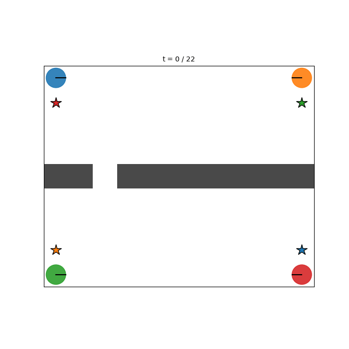

# sm-mcts-jax — Real-Time Multi-Agent Motion Planning with Simultaneous-Move MCTS

A from-scratch JAX reimplementation of
[motion-planning-using-sm-mcts](https://github.com/Enjayneering/motion-planning-using-sm-mcts):
game-theoretic motion planning with **Simultaneous-Move Monte Carlo Tree
Search** (Lanctot, Lisy & Winands, 2013), rebuilt for **real-time
closed-loop planning** and **N agents** instead of two.

| | original (pure Python) | this repo (JAX) |
|---|---|---|
| tree representation | Python objects, dicts | preallocated arrays, one XLA program |
| planning step | seconds–minutes | **~35–150 ms on a laptop CPU** (256–1024 simulations) |
| agents | 2 (hard-coded) | N (tested with 2–4) |
| rollouts | sequential | `vmap`-batched, `lax.scan` |
| hardware | CPU only | CPU / GPU / TPU without code changes |

<p align="center">
  
  
  
</p>

Left: two agents negotiating a narrow intersection — the search converges to
an equilibrium where one agent yields. Middle: four agents swapping positions
around a central obstacle, collision-free at ~15 planning steps per second on
CPU. Right: a **dynamic environment** — four agents crossing a wall whose two
gates open and close on a schedule; the planner times its crossings to the
gate windows.

## How it works

The algorithm is the same **decoupled-UCT SM-MCTS in a receding-horizon
(MPC-like) loop** as in the original research code:

1. Every world timestep, a search tree is grown from the current joint state.
2. In each node every agent keeps **its own** action statistics
   (visit counts, payoff sums) and selects its action **independently** via
   UCT — the simultaneous-move structure of the game is preserved, agents
   anticipate each other instead of planning sequentially.
3. The joint action indexes the child node; leaves are evaluated with
   goal-directed stochastic rollouts; per-agent payoffs (goal progress,
   collision penalties, goal bonus, time cost) are backpropagated decoupled.
4. The **robust-separate** final move (most-visited action per agent) is
   executed, the world advances one step, and the planner replans.

What makes it real-time is the implementation, not a different algorithm
(design inspired by [mctx](https://github.com/google-deepmind/mctx)):

- The whole tree lives in fixed-size arrays (`states`, `children`,
  `action_visits`, `action_qsum`, …) instead of Python objects.
- Selection, expansion, rollout and backpropagation for the *entire*
  simulation budget compile to a **single jitted XLA call**
  (`lax.fori_loop` over simulations, `lax.while_loop` for tree walks,
  `lax.scan` + `vmap` for batched rollouts).
- Collision checks (agent–agent swept-segment tests and occupancy-grid line
  search) are fully vectorized.

Payoffs and rollouts are guided by a **time-expanded steps-to-goal field**
per agent: a reverse BFS over (time, cell, heading) with the discrete
unicycle action set, computed once at world construction. It replaces the
original centerline-progress heuristic, cannot trap agents in local minima
behind walls, accounts for turn steps, and — in dynamic environments —
correctly values *waiting for a scheduled opening* as progress.

## Installation

```bash
pip install -e .            # CPU
pip install -e ".[cuda]"    # NVIDIA GPU (CUDA 12)
pip install -e ".[dev]"     # + pytest
```

## Quick start

```python
from sm_mcts_jax import Planner, MCTSParams, ascii_world
from sm_mcts_jax.viz import animate_trajectory

# '#' wall · '.' free · digit i = start of agent i · letter chr('a'+i) = its goal
env = ascii_world("""
    ##1##
    ##.##
    0...a
    ##.##
    ##b##
""")

planner = Planner(env, MCTSParams(num_simulations=512))
planner.warmup()                       # one-time JIT compile (~2 s)
traj = planner.run_episode(max_steps=40, verbose=True)
print(traj.summary())                  # steps, collisions, ms per plan step
animate_trajectory(env, traj, "demo.gif")
```

Dynamic environments are a list of ASCII frames (the first one defines
starts and goals); each frame is active for `frame_duration` timesteps and
the schedule repeats with `cycle=True`:

```python
env = ascii_world([gate_left_open, gate_right_open], frame_duration=4, cycle=True)
```

Or run the ready-made scenarios:

```bash
python examples/intersection.py       # 2 agents, narrow crossing
python examples/head_on_corridor.py   # 2 agents, symmetric head-on encounter
python examples/bottleneck.py         # 2 agents, single shared gap
python examples/four_agents.py        # 4 agents, obstacle avoidance
python examples/dynamic_gates.py      # 4 agents, alternating gates (dynamic env)
python examples/benchmark.py          # latency table for several budgets
```

## Configuration

```python
MCTSParams(
    num_simulations=512,   # tree-search iterations per planning step
    max_depth=12,          # in-tree planning horizon (timesteps)
    rollout_depth=12,      # heuristic rollout horizon beyond the leaf
    k_rollouts=4,          # rollouts averaged per leaf
    c_uct=1.4,             # exploration constant
    discount=0.95,
)

RewardParams(
    weight_progress=1.0,   # movement towards the own goal
    weight_collision=4.0,  # hard penalty inside the collision radius
    weight_proximity=0.5,  # soft shaping near other agents
    weight_goal=3.0,       # one-time arrival bonus
    weight_time=0.05,      # per-step cost until arrival
)

ascii_world(art,
    velocities=(0.0, 1.0),
    angular_velocities=(-1.5708, 0.0, 1.5708),
    dt=1.0, goal_radius=0.8, collision_radius=0.8,
)
```

Agents use a discrete-action unicycle model; heterogeneous agents are
supported by passing a per-agent action array (`actions[n_agents, n_actions, 2]`)
to `build_world`. Agents that reach their goal stop and stay there
("start–stop" tasks); the episode ends when everyone has arrived.

## Centralized vs. decentralized planning

`Planner` runs **one** search that recommends the full joint action — a
central coordinator, useful as an upper-bound baseline. The scientifically
interesting mode is `DecentralizedPlanner`: **every agent runs its own
independent search** from the same observed state (own RNG stream, batched
into one XLA call via `vmap`), simulates the others inside its tree, and
executes only its *own* action component. Coordination is not imposed — it
has to emerge from the agents solving the same game.

```python
from sm_mcts_jax import DecentralizedPlanner

planner = DecentralizedPlanner(env, MCTSParams(num_simulations=512))
traj = planner.run_episode(max_steps=40)
print(traj.summary())                  # includes prediction consistency
print(traj.predictions.shape)          # [T, n, n]: i's expectation of j
```

`traj.prediction_consistency` measures how often agent i's search correctly
anticipated agent j's executed action — direct evidence of equilibrium
agreement (0.67–0.73 in our scenarios, against a 1/6 uniform baseline).

`examples/experiment_decentralized.py` runs the full comparison (20 seeds x
2 modes x 3 scenarios, Wilson CIs, Fisher exact tests). Headline result:
decentralized planning matches the centralized coordinator's 100% success
rate on all three scenarios at a small coordination cost (~+0.7 steps per
episode); one episode in 60 showed a transient both-dodge-the-same-way
conflict that replanning resolved within three steps
(`docs/media/head_on_conflict.gif`). See `docs/THEORY.md` for what can and
cannot be proven about collision- and deadlock-freedom, and how to phrase
the empirical claims.

## Provably collision-free mode: the safety filter

```python
planner = DecentralizedPlanner(env, MCTSParams(num_simulations=512,
                                               safety_filter=True))
```

With `safety_filter=True` the search may only pick actions from a
**maximin-filtered set**: an action must (1) keep clear of every other
agent's current position and (2) be collision-free against *every*
filtered action of higher-priority agents. Under mild assumptions (mutual
initial separation, a stop action, common observability — see
`docs/SAFETY.md` for the exact statement and the one-page proof) this
guarantees:

- **No agent–agent collision, ever** — by induction, independent of search
  quality, simulation budget, or whether planning is centralized or
  decentralized. Zero is exact, not statistical.
- **No agent is ever left without a safe action** — standing still always
  survives the filter (Lemma 1), so the filter itself cannot cause a
  stuck state.

What it does *not* guarantee is liveness (arrival); that remains with the
search and the stochastic symmetry breaking (docs/THEORY.md). The measured
cost of the guarantee is roughly 2x planning time — and, perhaps
surprisingly, *no* extra steps: in all three benchmark scenarios the
filtered episodes were slightly **shorter** (e.g. head-on 9.4 vs. 10.1
steps) with **higher** prediction consistency (0.74–0.77 vs. 0.67–0.73),
because pruning the conflicting branches also simplifies equilibrium
selection. The structural conservatism (convoys keep a one-cell headway)
would only show in tighter maps. The theorem is
also checked mechanically: `tests/test_safety.py` enumerates the entire
product of filtered action sets in an adversarial configuration and
asserts the simulator's collision check never fires.
`examples/experiment_safety.py` measures the end-to-end effect.

A beginner-friendly German explanation of the filter (assumptions, proof
idea, results) is in `docs/SICHERHEITSFILTER_EINFACH.md`. Eleven showcase
animations covering all scenario/mode/filter combinations live in
`docs/media/showcase/` — rendered by `examples/render_showcase.py` in
**real-time playback**: each frame is shown for the episode's slowest
measured planning step, so watching them conveys the actual CPU speed of
every configuration.

## Measured performance (this repo's CI-class CPU, 2 agents, 36 joint actions)

| simulations | plan step | rate |
|---|---|---|
| 256 | ~36 ms | ~27 Hz |
| 512 | ~73 ms | ~14 Hz |
| 1024 | ~152 ms | ~7 Hz |

Four agents (1296 joint actions): ~66 ms / step (~15 Hz) at 384 simulations.
On a GPU the same code runs unmodified and faster; the search is a single
XLA program, so there is no Python overhead in the loop.

## Repository layout

```
sm_mcts_jax/
  dynamics.py        unicycle model + discrete action sets
  environment.py     grid worlds, ASCII parser, dynamic frames, free-space
                     checks, time-expanded steps-to-goal fields
  rewards.py         per-agent transition payoffs (progress/collision/goal)
  mcts.py            array-based decoupled-UCT SM-MCTS (single jitted search)
  planner.py         centralized receding-horizon loop + episode recording
  decentralized.py   one independent search per agent + consistency metrics
  viz.py             static plots and GIF/MP4 animations
examples/            runnable scenarios, benchmark, statistical experiment
tests/               unit + closed-loop integration tests (pytest)
docs/THEORY.md       provable vs. empirical claims (collisions, deadlocks)
```

## Limitations / research directions

- The joint child table grows with `n_actions ** n_agents`; fine up to ~5
  agents with small action sets, beyond that a hashed child store or
  factored trees would be needed.
- Selection policy is decoupled UCT; the original repo's Exp3 and
  regret-matching variants are natural extensions (all statistics are
  already stored decoupled per agent).
- Dynamic environments must follow a periodic (or eventually constant)
  schedule known in advance; unpredictably moving obstacles would need
  replanning-only handling.
- Tree reuse between planning steps (warm starts) is not implemented;
  each step searches from scratch.

## Reference

Lanctot, M., Lisy, V., & Winands, M. H. M. (2013). *Monte Carlo Tree Search
in Simultaneous Move Games with Applications to Goofspiel.*

## License

MIT — © 2026 Enjayneering
