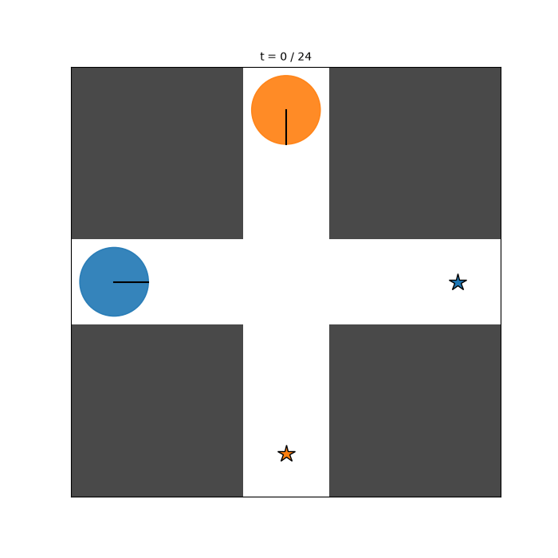
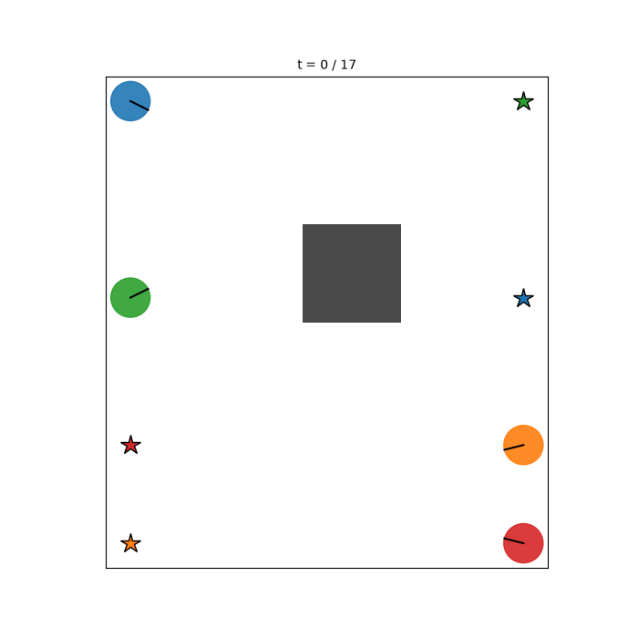

# sm-mcts-jax — Real-Time Multi-Agent Motion Planning with Simultaneous-Move MCTS

A from-scratch JAX reimplementation of
[motion-planning-using-sm-mcts](https://github.com/Enjayneering/motion-planning-using-sm-mcts):
game-theoretic motion planning with **Simultaneous-Move Monte Carlo Tree
Search** (Lanctot, Lisy & Winands, 2013), rebuilt for **real-time
closed-loop planning** and **N agents** instead of two.

| | original (pure Python) | this repo (JAX) |
|---|---|---|
| tree representation | Python objects, dicts | preallocated arrays, one XLA program |
| planning step | seconds–minutes | **~35–150 ms on a laptop CPU** (256–1024 simulations) |
| agents | 2 (hard-coded) | N (tested with 2–4) |
| rollouts | sequential | `vmap`-batched, `lax.scan` |
| hardware | CPU only | CPU / GPU / TPU without code changes |

<p align="center">
  
  
</p>

Left: two agents negotiating a narrow intersection — the search converges to
an equilibrium where one agent yields. Right: four agents swapping positions
around a central obstacle, collision-free at ~15 planning steps per second on CPU.

## How it works

The algorithm is the same **decoupled-UCT SM-MCTS in a receding-horizon
(MPC-like) loop** as in the original research code:

1. Every world timestep, a search tree is grown from the current joint state.
2. In each node every agent keeps **its own** action statistics
   (visit counts, payoff sums) and selects its action **independently** via
   UCT — the simultaneous-move structure of the game is preserved, agents
   anticipate each other instead of planning sequentially.
3. The joint action indexes the child node; leaves are evaluated with
   goal-directed stochastic rollouts; per-agent payoffs (goal progress,
   collision penalties, goal bonus, time cost) are backpropagated decoupled.
4. The **robust-separate** final move (most-visited action per agent) is
   executed, the world advances one step, and the planner replans.

What makes it real-time is the implementation, not a different algorithm
(design inspired by [mctx](https://github.com/google-deepmind/mctx)):

- The whole tree lives in fixed-size arrays (`states`, `children`,
  `action_visits`, `action_qsum`, …) instead of Python objects.
- Selection, expansion, rollout and backpropagation for the *entire*
  simulation budget compile to a **single jitted XLA call**
  (`lax.fori_loop` over simulations, `lax.while_loop` for tree walks,
  `lax.scan` + `vmap` for batched rollouts).
- Collision checks (agent–agent swept-segment tests and occupancy-grid line
  search) are fully vectorized.

## Installation

```bash
pip install -e .            # CPU
pip install -e ".[cuda]"    # NVIDIA GPU (CUDA 12)
pip install -e ".[dev]"     # + pytest
```

## Quick start

```python
from sm_mcts_jax import Planner, MCTSParams, ascii_world
from sm_mcts_jax.viz import animate_trajectory

# '#' wall · '.' free · digit i = start of agent i · letter chr('a'+i) = its goal
env = ascii_world("""
    ##1##
    ##.##
    0...a
    ##.##
    ##b##
""")

planner = Planner(env, MCTSParams(num_simulations=512))
planner.warmup()                       # one-time JIT compile (~2 s)
traj = planner.run_episode(max_steps=40, verbose=True)
print(traj.summary())                  # steps, collisions, ms per plan step
animate_trajectory(env, traj, "demo.gif")
```

Or run the ready-made scenarios:

```bash
python examples/intersection.py   # 2 agents, narrow crossing
python examples/four_agents.py    # 4 agents, obstacle avoidance
python examples/benchmark.py      # latency table for several budgets
```

## Configuration

```python
MCTSParams(
    num_simulations=512,   # tree-search iterations per planning step
    max_depth=12,          # in-tree planning horizon (timesteps)
    rollout_depth=12,      # heuristic rollout horizon beyond the leaf
    k_rollouts=4,          # rollouts averaged per leaf
    c_uct=1.4,             # exploration constant
    discount=0.95,
)

RewardParams(
    weight_progress=1.0,   # movement towards the own goal
    weight_collision=4.0,  # hard penalty inside the collision radius
    weight_proximity=0.5,  # soft shaping near other agents
    weight_goal=3.0,       # one-time arrival bonus
    weight_time=0.05,      # per-step cost until arrival
)

ascii_world(art,
    velocities=(0.0, 1.0),
    angular_velocities=(-1.5708, 0.0, 1.5708),
    dt=1.0, goal_radius=0.8, collision_radius=0.8,
)
```

Agents use a discrete-action unicycle model; heterogeneous agents are
supported by passing a per-agent action array (`actions[n_agents, n_actions, 2]`)
to `build_world`. Agents that reach their goal stop and stay there
("start–stop" tasks); the episode ends when everyone has arrived.

## Measured performance (this repo's CI-class CPU, 2 agents, 36 joint actions)

| simulations | plan step | rate |
|---|---|---|
| 256 | ~36 ms | ~27 Hz |
| 512 | ~73 ms | ~14 Hz |
| 1024 | ~152 ms | ~7 Hz |

Four agents (1296 joint actions): ~66 ms / step (~15 Hz) at 384 simulations.
On a GPU the same code runs unmodified and faster; the search is a single
XLA program, so there is no Python overhead in the loop.

## Repository layout

```
sm_mcts_jax/
  dynamics.py      unicycle model + discrete action sets
  environment.py   grid worlds, ASCII parser, vectorized free-space checks
  rewards.py       per-agent transition payoffs (progress/collision/goal)
  mcts.py          array-based decoupled-UCT SM-MCTS (single jitted search)
  planner.py       receding-horizon loop + episode recording
  viz.py           static plots and GIF/MP4 animations
examples/          runnable scenarios + benchmark
tests/             unit + closed-loop integration tests (pytest)
```

## Limitations / research directions

- The joint child table grows with `n_actions ** n_agents`; fine up to ~5
  agents with small action sets, beyond that a hashed child store or
  factored trees would be needed.
- Selection policy is decoupled UCT; the original repo's Exp3 and
  regret-matching variants are natural extensions (all statistics are
  already stored decoupled per agent).
- Static environments only (no closing doors yet) — time-indexed occupancy
  grids fit the array layout naturally.
- Tree reuse between planning steps (warm starts) is not implemented;
  each step searches from scratch.

## Reference

Lanctot, M., Lisy, V., & Winands, M. H. M. (2013). *Monte Carlo Tree Search
in Simultaneous Move Games with Applications to Goofspiel.*

## License

MIT — © 2026 Enjayneering
